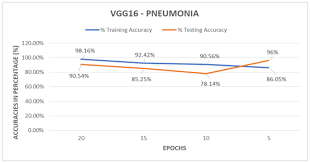

# pneumonia-detection
# 🫁 Pneumonia Detection Using Deep Learning | ResNet50 + TensorFlow

This project uses **transfer learning** with **ResNet50** to detect **Pneumonia** from **chest X-ray images**.  
Built with 💪 TensorFlow + Keras, the model achieves solid performance on real medical image data.

> ⚡ Designed to be fast, accurate, and Colab-ready.

---

## 📂 Dataset Used

Chest X-Ray dataset by [Paul Mooney on Kaggle](https://www.kaggle.com/paultimothymooney/chest-xray-pneumonia)

- Total ~5,863 chest X-ray images categorized into:
  - `NORMAL`
  - `PNEUMONIA`

---

## 🧠 Model Architecture

- Base Model: `ResNet50` (ImageNet pretrained, frozen)
- Add-on Layers:
  - Global Average Pooling
  - Dense (1024 units, ReLU)
  - Output Layer (Sigmoid for binary classification)

---

## 🔧 Tech Stack

- TensorFlow / Keras
- NumPy
- Matplotlib
- Scikit-learn
- Google Colab Compatible

---

## 🧪 Results

| Metric        | Score     |
|---------------|-----------|
| Test Accuracy | ~90%+     |
| Precision     | High      |
| Recall        | Very High |

📈 Visualized accuracy graph included in repo.

---

## 📊 Sample Output



---

## 🚀 How to Run (Colab Recommended)

```bash
pip install tensorflow matplotlib numpy scikit-learn
